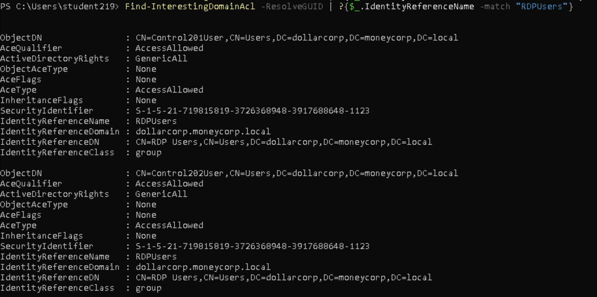

1)Finding the ACL for Domain Admins group

command:
```Get-DomainObjectAcl -ResolveGUIDs | ? { $_.SecurityIdentifier -eq "S-1-5-18" }```

o/p:
contians many, i just took one for reference

AceQualifier           : AccessAllowed
ObjectDN               : CN=Domain Admins,CN=Users,DC=dollarcorp,DC=moneycorp,DC=local
ActiveDirectoryRights  : ReadProperty
ObjectAceType          : User-Account-Restrictions
ObjectSID              : S-1-5-21-719815819-3726368948-3917688648-512
InheritanceFlags       : None
BinaryLength           : 60
AceType                : AccessAllowedObject
ObjectAceFlags         : ObjectAceTypePresent, InheritedObjectAceTypePresent
IsCallback             : False
PropagationFlags       : None
SecurityIdentifier     : S-1-5-32-554
AccessMask             : 16
AuditFlags             : None
IsInherited            : False
AceFlags               : None
InheritedObjectAceType : inetOrgPerson
OpaqueLength           : 0


Security identify have the Active Directory Rights on the Object DN


2)Find the ACL's where the studentx has the interesting permissions

command:

```  Find-InterestingDomainAcl -ResolveGUID | ?{$_.IdentityReferenceName -match "student219"}```

o/p:It contains nothing interesting,, but we know that studentx is member of rdp users group so we find for it 

```  Find-InterestingDomainAcl -ResolveGUID | ?{$_.IdentityReferenceName -match "RDPUsers"}```



we can see that RDPUsers have GenericAll rights on the Controlx users

3) Analyse the Persmission for studentx user using bloodhoundUI

Note that it is easier to analyze ACLs using BloodHound as it shows interesting ACLs for the user and the groups it is a member of. Let's look at the 'Outbound Object Control' for the studentx in the BloodHound CE UI:


we can find 3 intersting acls of RDPUsers
i)GenericAll on controlx and supprotx users
ii)Enrollment permissions on multiple certificate templates.
iii)GenericAll on AppLocker Group policy