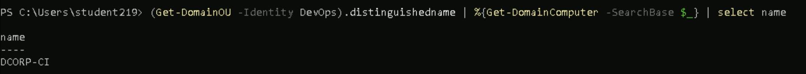

**1)List All the OU's**
command:
```  Get-DomainOU```

O/p:


**2) List all the computers in the Devops OU**

command:
``` (Get-DomainOU -Identity DevOps).distinguishedname | %{Get-DomainComputer -SearchBase $_} | select name ```

O/P:


**3)List the GPO's**

command:
```  Get-DomainGPO```

O/P:


**4)Enumerate GPO applied on the DevOpsOU**

First we need to list the OU's present,, in that we can find the DevOpsOU, under it there will be a attribute called "gplink" take that value 


Now we can find the GPO linked to the DevOps OU

command:
``` Get-DomainGPO -Identity "{0BF8D01C-1F62-4BDC-958C-57140B67D147}"```

O/P:
flags                    : 0
displayname              : DevOps Policy
gpcmachineextensionnames : [{35378EAC-683F-11D2-A89A-00C04FBBCFA2}{D02B1F72-3407-48AE-BA88-E8213C6761F1}][{827D319E-6EAC-11D2-A4EA-00C04F79F83A}{803E14A0-B4FB-11D0-A0
                           D0-00A0C90F574B}]
whenchanged              : 12/24/2024 7:09:01 AM
versionnumber            : 3
name                     : {0BF8D01C-1F62-4BDC-958C-57140B67D147}
cn                       : {0BF8D01C-1F62-4BDC-958C-57140B67D147}
usnchanged               : 296496
dscorepropagationdata    : {12/18/2024 7:31:56 AM, 1/1/1601 12:00:00 AM}
objectguid               : fc0df125-5e26-4794-93c7-e60c6eecb75f
gpcfilesyspath           : \\dollarcorp.moneycorp.local\SysVol\dollarcorp.moneycorp.local\Policies\{0BF8D01C-1F62-4BDC-958C-57140B67D147}
distinguishedname        : CN={0BF8D01C-1F62-4BDC-958C-57140B67D147},CN=Policies,CN=System,DC=dollarcorp,DC=moneycorp,DC=local
whencreated              : 12/18/2024 7:31:22 AM
showinadvancedviewonly   : True
usncreated               : 293100
gpcfunctionalityversion  : 2
instancetype             : 4
objectclass              : {top, container, groupPolicyContainer}
objectcategory           : CN=Group-Policy-Container,CN=Schema,CN=Configuration,DC=moneycorp,DC=local

so we can find that DevOps Policy is the GPO applied to the DevOps OU.

**5)Enumerate ACL's for the Applocker and DevOps OU**

Use bloodhound for this task and see the inbound and outbound object control of the DevOps and Applocker GPO's

in our attacking perspective we see who are all contains the write/genericall like permissions on these Policies so that we can abuse them

Based on the observation interesting things are:
i)RDPusers group has GenericAll/fullcontrol,GenericWrite over the applocker policy we can abuse it

ii)DEVOPSADMIN group has GenericWrite,WriteDacl and WriteOwner permission on the DevOps policy


