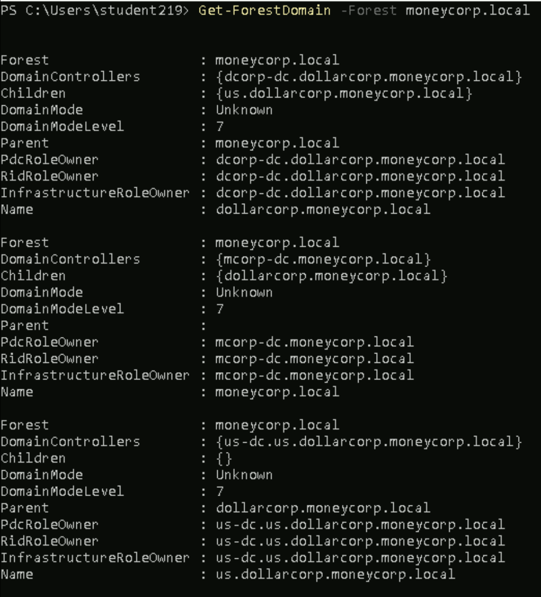
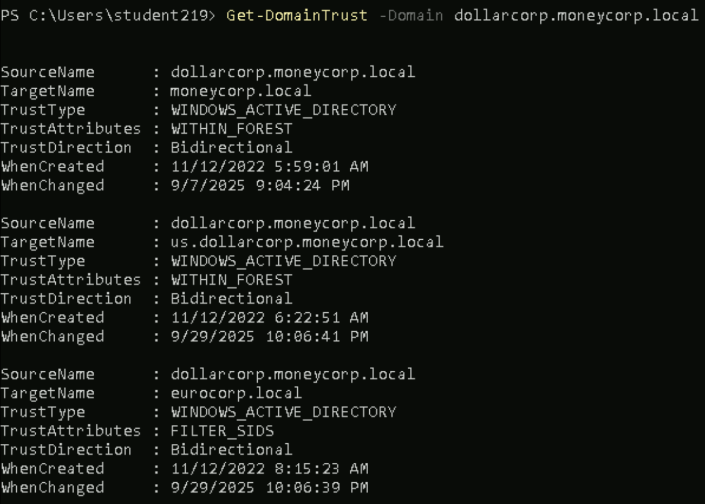
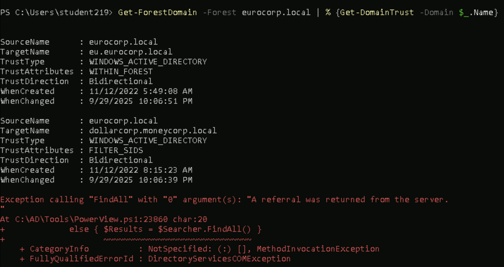

Learning Objective-4

# **1)Enumerate all domains in the moneycorp.local forest**

command:
``` Get-ForestDomain -Forest moneycorp.local```

O/P:


# **2)Map the trusts of the dollarcorp.moneycorp.local doamin**

command:
```  Get-DomainTrust -Domain dollarcorp.moneycorp.local```

O/P:


# **3)Map External Trusts of dollarcorp domain**

command:
```  Get-DomainTrust -Domain dollarcorp.moneycorp.local | ? {$_.TrustAttributes -eq "Filter_SIDS"}```

O/P:
it shows that thew external trust is with the eurocorp.local domain

# **4)Identify the external trust of dollarcorp domain. Can you enumerate trust for the trusting forest?**

in the above third question we have found that the external trust for the dollarcorp domain is eurocorp.local domain.
Now we try to enumerate the trusts of the trusting forest[eurocorp.local]

command:
``` Get-ForestDomain -Forest eurocorp.local | % {Get-DomainTrust -Domain $_.Name}```

O/P:


so we try to enumerate the trust for the domains[eurocorp.local and eu.eurocorp.local] in the eurocorp.local forest
As per the output we are able to enumerate the trusts of the eurocorp.local forest only,,, when trying to enumerate the trusts of the eu.eurocorp.local forest it throws error because the two way non transitive [external trust] exists between the dollarcorp and eurocorp domain,, so we will no be able to enumerate the trust of the eu.eurocorp domain from the dollarcorp domain!