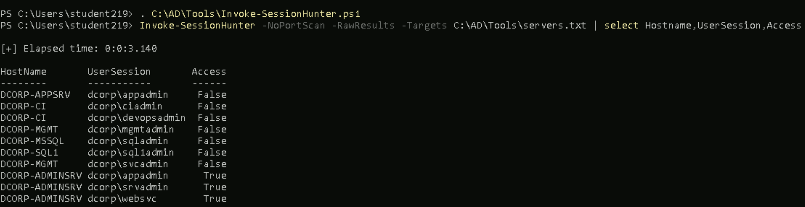

# **1)Identify a machine in the target domain where a Domain Admin session is available.**

First find who are the users present in the domain admins group
command:``` Get-DomainGroupMember -Identity "Domain Admins" -Recurse```
O/P:
svc admin, Administrator
already this also found early during enumeration

Now find the active domainadmins session [svc admin, Administrator] using Invoke-SessionHunter because we dont have admin privilege

load the session hunter.Command:```svc admin, Administrator```
now find sessions.Command:```Invoke-SessionHunter -NoPortScan -RawResults -Targets C:\AD\Tools\servers.txt | select Hostname,UserSession,Access```

O/P:


So we have svcadmin[domainadmins group] active session on dcorp-mgmt machine.


# **2)Compromise the machine and escalate privileges to Domain Admin by abusing reverse shell on dcorp-ci.**